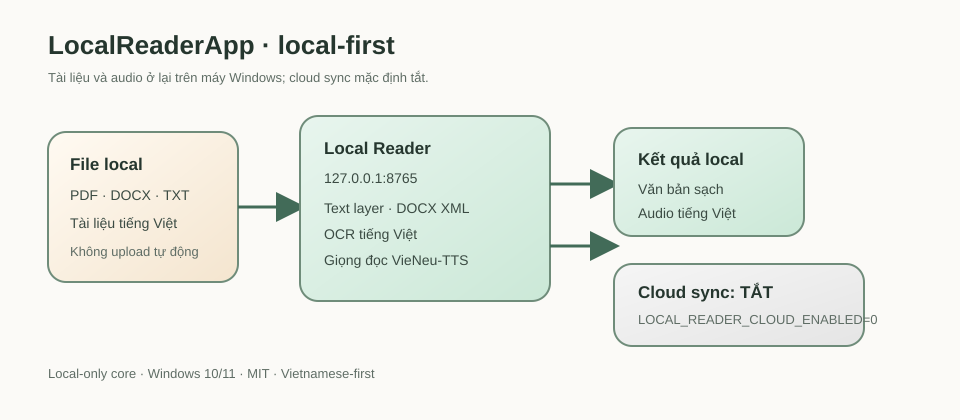

# LocalReaderApp

LocalReaderApp là trình đọc tài liệu chạy **local-first** trên Windows, ưu tiên người dùng Việt Nam. Ứng dụng nhận PDF, DOCX và TXT; trích xuất văn bản, dùng OCR tiếng Việt cho PDF scan, và có thể tạo giọng đọc tiếng Việt bằng VieNeu-TTS chạy trên máy.

> Trạng thái: đang chuẩn bị bản phát hành `v0.1.0`. Bản đầu tiên hữu ích cho việc dùng thử và đóng góp, nhưng chưa cam kết hỗ trợ mọi cấu hình Windows/GPU.

## Tính năng

- Đọc PDF, DOCX và TXT từ máy tính local.
- Ưu tiên text layer của PDF; fallback sang OCR tiếng Việt cho trang scan.
- Chạy dịch vụ HTTP local tại `127.0.0.1:8765`.
- Có thể dùng VieNeu-TTS local để tạo audio tiếng Việt khi cài runtime tùy chọn.
- Cloud sync tắt trong launcher public local-first.



## Quyền riêng tư và phạm vi

Bản mặc định giữ tài liệu, văn bản trích xuất và audio trên máy; core workflow không yêu cầu tài khoản và không gửi telemetry. Mã cloud vẫn giữ để phát triển trong tương lai, nhưng launcher luôn đặt `LOCAL_READER_CLOUD_ENABLED=0`. Không bật cloud nếu chưa tự kiểm tra credential, quyền lưu trữ và rủi ro dữ liệu.

Không đưa API key, service-role key, tài liệu riêng tư, audio sinh ra, cache hoặc thư mục runtime vào repository. Xem [SECURITY.md](SECURITY.md) và [THIRD_PARTY_NOTICES.md](THIRD_PARTY_NOTICES.md).

## Yêu cầu

- Windows 10 hoặc 11.
- Python 3.11 hoặc 3.12; CI smoke-test dùng Python 3.11. Python 3.10 và 3.13 chưa thuộc bản release đã kiểm chứng.
- Cần Internet ở lần cài dependency/model đầu tiên. Sau đó core reader xử lý file local mà không cần tài khoản cloud.
- Cài Tesseract OCR để OCR PDF scan; app tự nhận `tessdata` của Tesseract trên máy, và nên có thêm `vie.traineddata` để nhận tiếng Việt.

## Cài đặt và chạy

1. Download hoặc clone repository.
2. Chạy **Setup Local Reader.bat** một lần. Script tạo runtime riêng trong `%LOCALAPPDATA%\\LocalReaderApp` và cài bộ dependency CPU hoặc NVIDIA đã pin version.
3. Chạy **Local Reader.bat**.
4. Mở <http://127.0.0.1:8765> trên trình duyệt.
5. Khi xong, chạy **Stop Local Reader.bat**.

Script setup không tự cài một PDF engine “latest” không giới hạn. Hai file `requirements-*.lock.txt` là bộ cài đã resolve đầy đủ cho Windows/Python 3.12; `requirements-cpu.txt` và `requirements-gpu.txt` là bộ dependency trực tiếp để maintainer review. Chỉ cập nhật lock sau khi smoke-test trên môi trường sạch.

## Kiểm tra dành cho contributor

```powershell
python -m compileall -q .
python scripts/public_tree_check.py
python -m unittest discover -s tests -v
```

Test không upload tài liệu và không bật cloud sync. Pull request nên có test hồi quy hoặc giải thích rõ vì sao test không thực tế.

## Giới hạn hiện tại

- Bản đầu tập trung Windows và dùng batch setup, chưa có installer độc lập.
- GPU là tùy chọn, phụ thuộc môi trường NVIDIA/PyTorch tương thích.
- Lock GPU đã resolve được nhưng chưa được smoke-test bằng máy NVIDIA trong môi trường phát hành này; không xem đó là bằng chứng GPU/TTS đã chạy.
- Chất lượng OCR phụ thuộc Tesseract và language data đã cài.
- Cloud/mobile synchronization chưa thuộc hợp đồng của bản mặc định.

## English summary

LocalReaderApp is a privacy-oriented Windows reader for PDF, DOCX, and TXT documents, with Vietnamese OCR and optional local Vietnamese TTS. The default launcher binds only to localhost and keeps cloud synchronization off. Contributions, bug reports, and reproducible test cases are welcome.

See [CONTRIBUTING.md](CONTRIBUTING.md), [RELEASE.md](RELEASE.md), [RELEASE_NOTES_v0.1.0.md](RELEASE_NOTES_v0.1.0.md), [SECURITY.md](SECURITY.md), and [CHANGELOG.md](CHANGELOG.md).

## License

LocalReaderApp is released under the MIT License. Third-party components retain their own licenses; see [THIRD_PARTY_NOTICES.md](THIRD_PARTY_NOTICES.md).
